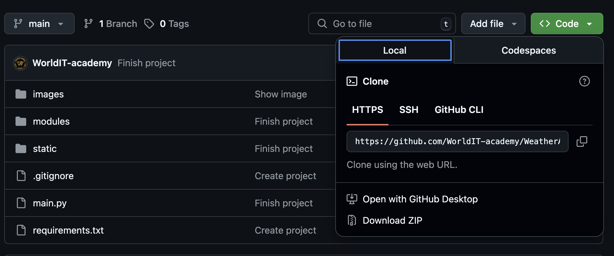

# WEATHER APPLICATION

Цей проект розроблено з метою ознайомлення із роботою API, принципом отримання даних від віддаленого серверу, вмінням їх обробляти, структурувати та застосовувати у своємо проєкті. А саме застосовувалось API такого веб-ресурсу як [OpenWeatherMap](https://openweathermap.org). Проєкт допоможе розібратися із роботою файлів JSON, як правильно отримувати та зберігати дані у файлах з типом .json. Та познайомити користувача з інтерфейсом застосунку розробленим за допомогою пакету [CustomTkinter](https://customtkinter.tomschimansky.com).

### Зміст:
- [Основні модулі проєкту](#modules).
- [Розгортання проєкту](#download).
- [Створення віртуального оточення проєкту](#venv).
- [Завантаження модулей до віртуального оточення](#download-venv).
- [Старт проєкту](#start-project).
- [Основні механіки проєкту](#mechanics).
- [Висновок по проєкту](#result).

### Modules:
Всі модулі
1. [customtkinter](https://customtkinter.tomschimansky.com).
2. [json](https://docs.python.org/3/library/json.html).
3. [colorama](https://pypi.org/project/colorama/).
4. [os](https://docs.python.org/uk/3.13/library/os.html).
5. [requests](https://pypi.org/project/requests/).
6. [pillow](https://pypi.org/project/pillow/).
7. [datetime](https://docs.python.org/3/library/datetime.html).

### Download:
Завантаження проєкту
- ##### Git clone:

    - Отримати посилання для клонування проєкту.

    

    - Відкрити VSCode --> у Explorer VSCode відкрити папку для збереження склонованого проєкту --> та у Terminal прописати команду: 
    - `git clone https://github.com/WorldIT-academy/WeatherApp.git`

    

    - Відкрити каталог, який ви склонували у Explorer VSCode.
    
- ##### Download ZIP

### Venv:
Створення віртуального оточення

- Відкривши папку з проектом та термінал, пропишіть у bash терміналі команду:
- `python -m venv venv`

Після цього пропишіть наступну команду залежно від вашого ПК:

- Windows:
`venv\Scripts\activate`

- Mac/Linux:
`source venv/bin/activate'python -m venv venv`

### Download venv:
Завантаження модулів до venv

- Переконавшись, що віртуальне середовище активовано, прописати команду:

`pip install -r requirements.txt`
### Start project:
Cтарт проєкту
Переконавшись, що всі модулі встановлені, запустити застосунок:

`python main.py`
### Mechanics:
Основні механіки проєкту
- Дизайн зроблений за допомогою CustomTkinter.
- Отримання даних відбувається за допомогою API від OpenWeatherMap.
- Зберігання інформації відбувається за допомогою JSON.
### Result:
Висновок
- Завдяки цьому проєкту ми ознайомилися з принципами роботи з API та форматами JSON.
- Вивчили створення та використання віртуального оточення Python.
- Ознайомились з роботою з модулями requests, customtkinter, pillow та іншими.
